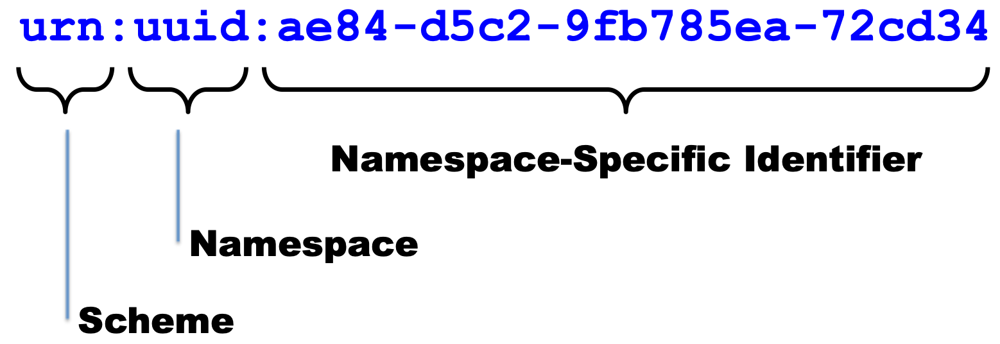
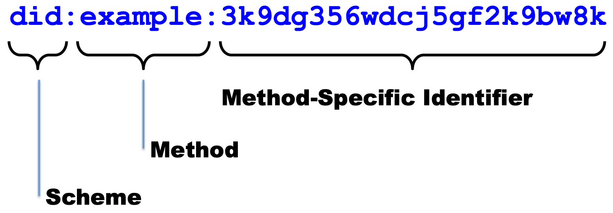

<!----- Conversion time: 3.131 seconds.


Using this Markdown file:

1. Cut and paste this output into your source file.
2. See the notes and action items below regarding this conversion run.
3. Check the rendered output (headings, lists, code blocks, tables) for proper
   formatting and use a linkchecker before you publish this page.

Conversion notes:

* Docs to Markdown version 1.0β16
* Sun Mar 03 2019 08:11:06 GMT-0800 (PST)
* Source doc: https://docs.google.com/a/consensys.net/open?id=1i66zZVjST2wjqCnL_b3bN0SIhN-C_swFeCjaPdIxANI
* This document has images: check for >>>>>  gd2md-html alert:  inline image link in generated source and store images to your server.

WARNING:
You have 12 H1 headings. You may want to use the "H1 -> H2" option to demote all headings by one level.

----->

# Understanding DIDs in Greater Depth

A paper originating at the Rebooting the Web of Trust #8 Design Workshop

2019-03-03

Authors: Drummond Reed, Ken Ebert, Daniel C. Burnett


## Introduction

If you know nothing about DIDs, and just want a quick overview, read the DID Primer. If you need to understand in better detail but don't want to have to read the entire DID specification, this document is for you.

It gives the motivations for creating DIDs, their structure, and associated documents, methods, authentication, resolution, and dereferencing.

This document is not intended to be an definitive specification; implementers please refer to the draft specification ([Decentralized Identifiers (DIDs) v0.11](https://w3c-ccg.github.io/did-spec/)) for the details.


## Understanding the Motivations for DIDs

When Verifiable Credentials (see [Verifiable Credentials Data-Model Explainer](https://github.com/w3c/vc-data-model/blob/gh-pages/VCDMExplainer.md)) were being developed, the WG needed identifiers for Issuers, Verifiers, and the Subjects that the credential claims were about. The first option considered as potential identifiers was email addresses or account names on popular services such as those from Facebook or Google. However, these addresses can be taken away from the person who uses them.

Another option considered was URLs. The identifier owner believes he controls the domain names permanently. Unfortunately, those, too, are only "leased" and not actually "owned", and can thus be taken away just like the email addresses or account names.

Basing the existence of and control over an identifier on blockchain or decentralized ledgers in general offers the opportunity for identifiers that really can only be controlled or deactivated by whoever controls the corresponding cryptographic keys. These are Decentralized Identifiers (note: not decentralized identities).

For use cases where the need for this independence of control ranges from "nice to have" to "absolutely critical", take a look at the [Use Cases for Decentralized Identifiers](https://w3c-ccg.github.io/did-use-cases/).


## Understanding the Structure of DIDs and DID URLs

In this section we'll explain the basic structure of DIDs as a new form of identifier. Then in later sections we'll explain in more detail how each of these components of a DID and DID URL are used.


### First, Let's Start With a Long-Established Identifier: URNs

The basic structure (called the "syntax") of DIDs is based on the pattern established by URNs (Uniform Resource Names). This is a specific type of identifiers for the World Wide Web whose purpose is to provide persistent identification of a resource, i.e., an identifier that will never change (literally, forever). The URN specification was originally defined in 1997 by [RFC 2141](https://tools.ietf.org/html/rfc2141) and is now defined by [RFC 8141](https://tools.ietf.org/html/rfc8141). This is what the structure of URN looks like:





### Now, Let's Understand "Naked DIDs"

A "naked DID" (a DID that does not include any additional components described later in this document) follows the exact same structure.





### Let's Now Look at URLs, Starting With an HTTP URL

We use URLs every day as identifiers that, in our web browsers, refer to downloadable or executable resources on the World Wide Web.  DIDs are another form of identifiers that refer to a DID Subject. A DID Subject can have many properties. For example, a credential can be associated wtih a DID Subject using verifiable credentials. We expect the most common use will be as references to people and organizations.

HTTP URL strings look like the following:


### Okay, So Now What's a "DID URL"?

The idea of a DID URL is that it has the same overall syntactic structure as an HTTP URL except for the structure of the "authority" part.


To clarify terminology, here are the two terms used in the DID ABNF and the DID specification to talk about overall sets of DID URL syntax:


Note that, as this diagram suggests a "naked DID" is actually, by itself, a valid DID URL. It just doesn't have any other the other three standard components that can be in a URL, i.e. a path, a query, or a fragment. 

But if you want to refer to an identifier rooted on a naked DID that **may** include the other parts of a URL, i.e., the path, query, or fragment components.

THIS IS AS FAR AS WE HAVE PREPARED THE DRAFT OF THIS DOCUMENT AT RWOT8. THE AUTHORS WILL BE CONTINUING AFTER RWOT8 TO COMPLETE THIS DOCUMENT.

Syntactically, a DID looks like this:

(Need DID picture here pointing at different parts)

The three parts of a DID, separated by colons, are: \
The string "did", representing the "did" URI scheme. \
A DID method, in this case "btcr", that must be one of the values in the to-be-created DID Registry \
A string that is interpreted according to the rules of the specific DID method. \


## Understanding DID Methods


## Understanding DID Documents


## Understanding DID Authentication 


## Understanding DID Resolution and Dereferencing


## Understanding DID Fragment References


## Understanding DID Content References


## Understanding DID Service References


## Appendix A: ANBF for DIDs and DID URLs

NOTE: The following ABNF is currently a proposal for the [DID Specification](https://w3c-ccg.github.io/did-spec/) at the W3C Credentials Community Group. The intent is for this appendix to always contain a copy of the authoritative ABNF for DIDs and DID URLs.

```abnf
; !syntax("abnf")
did                       = "did:" method ":" method-specific-idstring
method                    = 1*methodchar
methodchar                = %x61-7A / DIGIT
method-specific-idstring  = idstring *( ":" idstring )
idstring                  = 1*idchar
idchar                    = ALPHA / DIGIT / "." / "-"
did-url                   = did [ did-relative-ref ]
did-relative-ref          = did-fragment-ref / did-service-ref
did-fragment-ref          = ";" fragment
uri-safe-char             = idchar / "_" / pct-encoded
did-service-ref           = ";" service-id [ path-abempty ] [ "?" query ]
                            [ "#" fragment ]
service-id                = service-idstring *( ":" service-idstring )
service-idstring          = 1*uri-safe-char
did-reference             = did-url / did-relative-ref

ALPHA                     =  %x41-5A / %x61-7A   ; A-Z / a-z
DIGIT                     =  %x30-39             ; 0-9
```


## Appendix B: ABNF for URIs (RFC 3986)

The syntax path through the ABNF used by a DID is highlighted in red below.


```abnf
; Appendix A.  Collected ABNF for URI

   URI           = scheme ":" hier-part [ "?" query ] [ "#" fragment ]

   hier-part     = "//" authority path-abempty
                 / path-absolute
                 / path-rootless
                 / path-empty

   URI-reference = URI / relative-ref

   absolute-URI  = scheme ":" hier-part [ "?" query ]

   relative-ref  = relative-part [ "?" query ] [ "#" fragment ]

   relative-part = "//" authority path-abempty
                 / path-absolute
                 / path-noscheme
                 / path-empty

   scheme        = ALPHA *( ALPHA / DIGIT / "+" / "-" / "." )

   authority     = [ userinfo "@" ] host [ ":" port ]
   userinfo      = *( unreserved / pct-encoded / sub-delims / ":" )
   host          = IP-literal / IPv4address / reg-name
   port          = *DIGIT

   IP-literal    = "[" ( IPv6address / IPvFuture  ) "]"

   IPvFuture     = "v" 1*HEXDIG "." 1*( unreserved / sub-delims / ":" )

   IPv6address   =                            6( h16 ":" ) ls32
                 /                       "::" 5( h16 ":" ) ls32
                 / [               h16 ] "::" 4( h16 ":" ) ls32
                 / [ *1( h16 ":" ) h16 ] "::" 3( h16 ":" ) ls32
                 / [ *2( h16 ":" ) h16 ] "::" 2( h16 ":" ) ls32
                 / [ *3( h16 ":" ) h16 ] "::"    h16 ":"   ls32
                 / [ *4( h16 ":" ) h16 ] "::"              ls32
                 / [ *5( h16 ":" ) h16 ] "::"              h16
                 / [ *6( h16 ":" ) h16 ] "::"

   h16           = 1*4HEXDIG
   ls32          = ( h16 ":" h16 ) / IPv4address
   IPv4address   = dec-octet "." dec-octet "." dec-octet "." dec-octet
   dec-octet     = DIGIT                 ; 0-9
                 / %x31-39 DIGIT         ; 10-99
                 / "1" 2DIGIT            ; 100-199
                 / "2" %x30-34 DIGIT     ; 200-249
                 / "25" %x30-35          ; 250-255

   reg-name      = *( unreserved / pct-encoded / sub-delims )

   path          = path-abempty    ; begins with "/" or is empty
                 / path-absolute   ; begins with "/" but not "//"
                 / path-noscheme   ; begins with a non-colon segment
                 / path-rootless   ; begins with a segment
                 / path-empty      ; zero characters

   path-abempty  = *( "/" segment )
   path-absolute = "/" [ segment-nz *( "/" segment ) ]
   path-noscheme = segment-nz-nc *( "/" segment )
   path-rootless = segment-nz *( "/" segment )
   path-empty    = 0<pchar>

   segment       = *pchar
   segment-nz    = 1*pchar
   segment-nz-nc = 1*( unreserved / pct-encoded / sub-delims / "@" )
                 ; non-zero-length segment without any colon ":"

   pchar         = unreserved / pct-encoded / sub-delims / ":" / "@"

   query         = *( pchar / "/" / "?" )

   fragment      = *( pchar / "/" / "?" )

   pct-encoded   = "%" HEXDIG HEXDIG

   unreserved    = ALPHA / DIGIT / "-" / "." / "_" / "~"
   reserved      = gen-delims / sub-delims
   gen-delims    = ":" / "/" / "?" / "#" / "[" / "]" / "@"
   sub-delims    = "!" / "$" / "&" / "'" / "(" / ")"
                 / "*" / "+" / "," / ";" / "="


<!-- Docs to Markdown version 1.0β16 -->
